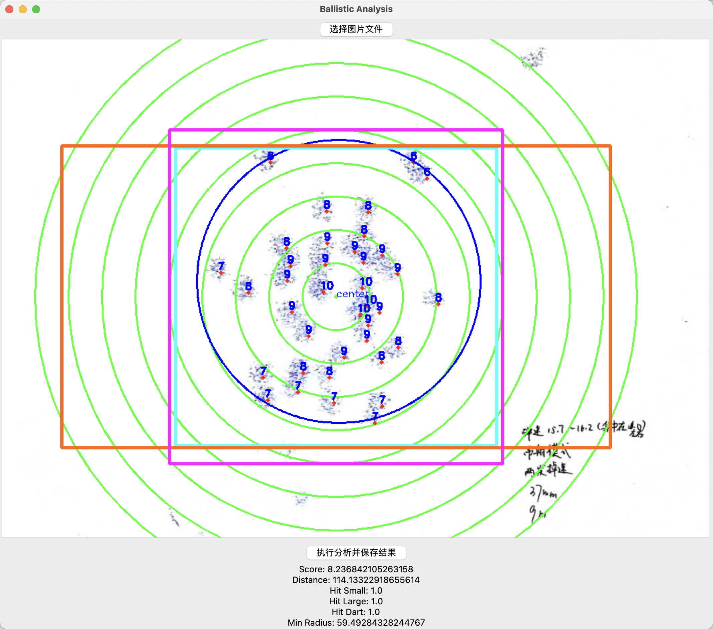

# RM 弹道分析系统

<div align="center">

[](LICENSE)
[](https://github.com/MicDZ/RM-Ballistic-Analysis/stargazers)

一个专为 RoboMaster 机器人比赛设计的弹道分析工具，支持 Web 界面和 Python 桌面版本。

[在线体验](https://rm.mcdz.cn) | [功能特性](#功能特性) | [快速开始](#快速开始)

</div>



## 📋 目录

- [功能特性](#功能特性)
- [快速开始](#快速开始)
  - [Web 版本（推荐）](#web-版本推荐)
  - [Python 桌面版本](#python-桌面版本)
- [使用说明](#使用说明)
  - [Web 版本使用指南](#web-版本使用指南)
  - [Python 版本使用指南](#python-版本使用指南)
- [分析指标](#分析指标)
- [常见问题](#常见问题)
- [技术栈](#技术栈)
- [项目结构](#项目结构)
- [开发者说明](#开发者说明)
- [贡献](#贡献)
- [许可证](#许可证)

## ✨ 功能特性

### Web 版本（index.html）

- 🎯 **零安装，开箱即用** - 纯浏览器运行，无需安装任何依赖
- 📸 **图片上传与管理**
  - 支持拖拽上传和点击选择
  - 支持 JPG、PNG 等常见图片格式
  - 提供示例图片快速体验
- 🖱️ **交互式弹孔标记**
  - 点击图片即可标记弹孔位置
  - 支持撤销和清除操作
  - 实时显示已标记点数
- ✂️ **智能裁剪功能**
  - 支持多种纸张尺寸（A3、A4、A5、Letter、Legal）
  - 按比例约束的智能框选
  - 横向布局优化
- 🎨 **文本标注工具**
  - 自定义文本内容
  - 可调节字号（14-32px）
  - 自定义颜色选择
  - 点击画布精确定位
- 🎯 **多种靶心模式**
  - 点群中心：基于弹孔集中位置计算
  - 图片中心：基于图片几何中心计算
- 📊 **全面的弹道分析**
  - 平均环数计算（10 环制）
  - 平均距离统计
  - 小装甲板命中率（135×125mm）
  - 大装甲板命中率（230×127mm）
  - 飞镖装甲命中率（140×140mm）
- 🔍 **视图控制**
  - 缩放功能（支持放大/缩小）
  - 缩略图导航（小地图）
  - 拖拽式视窗控制
- 💾 **数据导出**
  - PNG 图片导出（带二维码和水印）
  - JSON 数据导出（完整分析结果）
  - 统一时间戳命名
- 📱 **响应式设计** - 支持桌面和移动设备

### Python 桌面版本

- 🖥️ **原生桌面应用** - 基于 Tkinter 的图形界面
- 🔬 **精确分析** - 使用 OpenCV 进行图像处理
- 💾 **本地保存** - 结果保存为 TXT 和图片文件

## 🚀 快速开始

### Web 版本（推荐）

1. **在线使用**
   ```
   访问 https://rm.mcdz.cn
   ```

2. **本地运行**
   ```bash
   # 克隆仓库
   git clone https://github.com/MicDZ/RM-Ballistic-Analysis.git
   cd RM-Ballistic-Analysis
   
   # 使用任意 Web 服务器打开 index.html
   # 方式 1: Python 3
   python -m http.server 8000
   
   # 方式 2: Node.js
   npx http-server
   
   # 然后在浏览器中访问 http://localhost:8000
   ```

### Python 桌面版本

1. **安装依赖**
   ```bash
   pip install numpy opencv-python pillow
   ```

2. **运行程序**
   ```bash
   python ui.py
   ```

## 📖 使用说明

### Web 版本使用指南

#### 1. 上传靶纸图片
- **方式一**：点击上传区域，选择本地图片
- **方式二**：拖拽图片到上传区域
- **方式三**：点击"加载示例"按钮体验演示

#### 2. 裁剪图片（可选）
1. 点击"开始裁剪"按钮打开裁剪弹窗
2. 从下拉菜单选择纸张尺寸（默认 A4）
3. 在画布上拖拽框选需要的区域
4. 点击"确认裁剪"完成裁剪

#### 3. 标记弹孔位置
- 在图片上点击标记弹孔位置
- 红色圆点表示已标记的弹孔
- 使用"撤销"按钮删除最后一个点
- 使用"清除"按钮删除所有点

#### 4. 添加文本标注（可选）
1. 在"文本标注"区域输入文本内容
2. 选择字号和颜色
3. 点击"放置"按钮
4. 在画布上点击确定文本位置

#### 5. 选择靶心模式
- **点群中心**（默认）：以所有弹孔的平均位置为靶心
- **图片中心**：以图片的几何中心为靶心

#### 6. 分析弹道
1. 点击"分析"按钮进行弹道分析
2. 查看右侧统计面板的分析结果
3. 图片上会显示：
   - 绿色中心点和同心圆（10 环制）
   - 蓝色环数标注
   - 黄色小装甲板框
   - 蓝色大装甲板框
   - 紫色飞镖装甲框

#### 7. 保存结果
点击"保存"按钮，自动下载：
- 带标注的结果图片（PNG 格式，含二维码水印）
- 完整的分析数据（JSON 格式）

### Python 版本使用指南

1. 运行 `python ui.py` 启动程序
2. 点击"选择图片文件"按钮加载靶纸图片
3. 在画布上点击标记弹孔位置
4. 点击"执行分析并保存结果"进行分析
5. 结果自动保存在图片同目录下

## 📊 分析指标

- **平均环数**：所有弹孔的环数平均值（10 环制，越高越好）
- **平均距离**：所有弹孔到靶心的平均距离（像素，越小越好）
- **小装甲板命中率**：落在 135×125mm 矩形范围内的弹孔比例
- **大装甲板命中率**：落在 230×127mm 矩形范围内的弹孔比例
- **飞镖装甲命中率**：落在 140×140mm 矩形范围内的弹孔比例

*注：装甲板尺寸基于 RoboMaster 机器人比赛标准规格*

## ❓ 常见问题

### Q: Web 版本和 Python 版本有什么区别？
A: Web 版本无需安装任何软件，直接在浏览器中使用，功能更丰富（支持裁剪、文本标注、缩放等）；Python 版本需要安装依赖，但可以离线使用且更适合批量处理。

### Q: 如何获得最佳分析效果？
A: 建议：
1. 使用清晰的靶纸照片
2. 确保光线均匀，避免反光
3. 拍摄时保持垂直角度
4. 如有需要，使用裁剪功能去除多余部分

### Q: 可以分析多个靶纸吗？
A: Web 版本一次处理一张图片；Python 版本可以通过修改代码实现批量处理。

### Q: 数据如何导出？
A: Web 版本点击"保存"按钮会同时下载 PNG 图片和 JSON 数据文件；Python 版本会在图片同目录生成 TXT 文件和结果图片。

## 🛠️ 技术栈

### Web 版本
- **前端**：纯原生 JavaScript（无框架依赖）
- **UI**：HTML5 Canvas + CSS3
- **图标**：Font Awesome 6.5.0
- **特性**：
  - 离线可用
  - 响应式设计
  - 无后端依赖

### Python 版本
- **GUI 框架**：Tkinter
- **图像处理**：OpenCV (cv2)
- **数值计算**：NumPy
- **图像库**：Pillow (PIL)

## 📁 项目结构

```
RM-Ballistic-Analysis/
├── index.html          # Web 版本主文件（推荐使用）
├── ui.py              # Python 桌面版 GUI 主程序
├── analyze.py         # 弹道分析核心算法
├── analyze_alone.py   # 独立分析脚本（开发用）
├── gen.py             # QR 码生成工具（开发用）
├── qrcode.json        # QR 码数据文件
├── demo.jpg           # 示例靶纸图片
├── 20240424_9m_1.png  # 效果演示图
├── ui.spec            # PyInstaller 打包配置
├── LICENSE            # GPL v3 许可证
└── README.md          # 项目说明文档
```

## 💡 开发者说明

- **gen.py**：用于生成 Web 版本所需的二维码矩阵数据，输出到 `qrcode.json`
- **analyze_alone.py**：独立的分析脚本，可直接运行用于快速测试
- **ui.spec**：PyInstaller 配置文件，用于将 Python 版本打包为独立可执行文件

## 🤝 贡献

欢迎提交 Issue 和 Pull Request！

如果这个项目对你有帮助，请考虑给个 ⭐ Star 支持一下！

## 📄 许可证

本项目采用 [GNU General Public License v3.0](LICENSE) 许可证。

---

<div align="center">

**[⬆ 回到顶部](#rm-弹道分析系统)**

Made with ❤️ for RoboMaster Community

</div>
